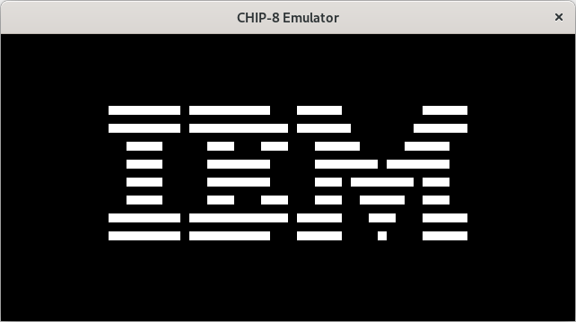
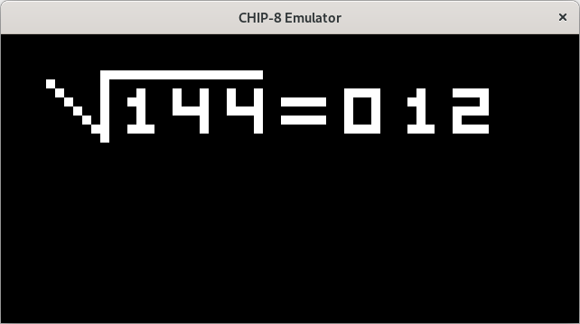
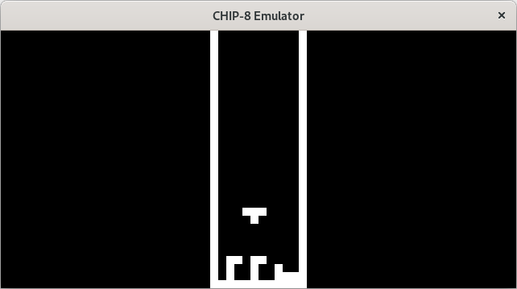
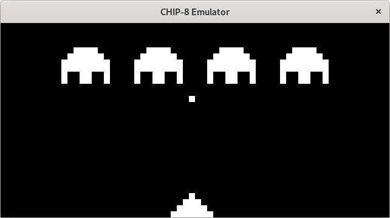
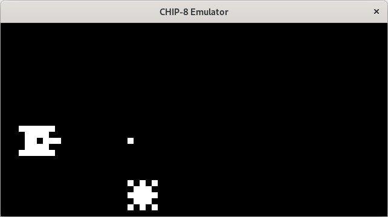

# Description
This is a toy CHIP8 Interpreter written in C. I have only tested this on GNU/Linux. It may not work on other platforms.

# Building

You need cmake and SDL2 in order to build this.

```
$ git clone https://github.com/npate012/chip8_c.git
$ cd chip8_c
$ mkdir build
$ cd build
$ cmake ..
$ make
```

# Usage
```
USAGE:
    ./chip8emu ROM_location
```

# Screenshots
## IBM Logo


# SQRT


# Tetris


# Space Invaders


# Tank


# Status
This emulator works reasonably well for most roms. However, the following features are missing:
- Beeping
- Logging
- Adjustable emulation speed


